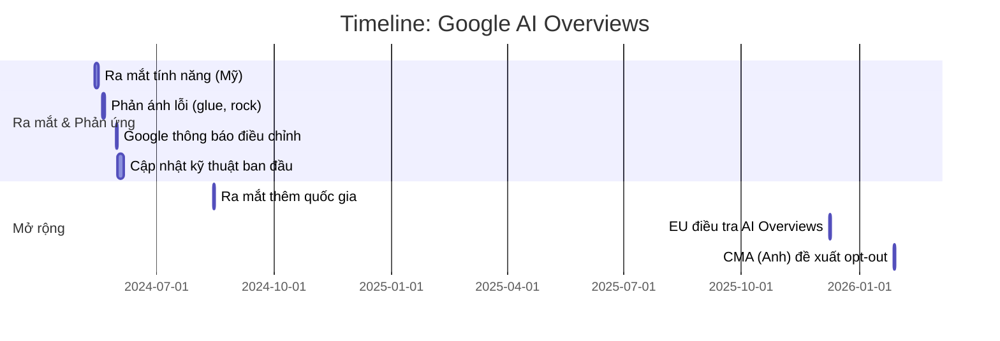
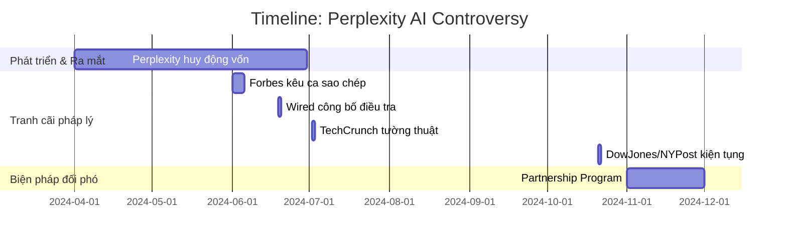
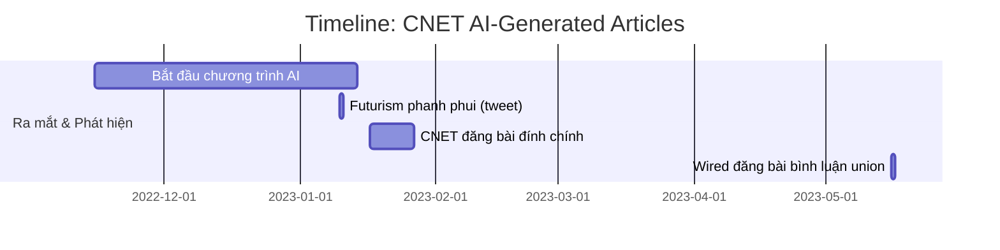

# Báo cáo Phân tích AI Safety – Ngành **Trợ lý Tin tức AI** (Media/News)

## Tóm tắt Tóm lược  
Trong ngành tin tức, các trợ lý AI (AI News Assistant) đang được ứng dụng để **tìm kiếm, tổng hợp, tóm tắt và trả lời câu hỏi dựa trên nội dung báo chí**. Các hệ thống này có thể cải thiện trải nghiệm người dùng nhưng đồng thời tiềm ẩn nhiều rủi ro an toàn: từ việc tạo ra thông tin sai lệch (hallucination), xuyên tạc hay bỏ sót thông tin quan trọng, đến vi phạm bản quyền và giảm doanh thu của nhà xuất bản. Theo báo cáo của Reuters Institute (2026), có khoảng **10% người dùng toàn cầu** bắt đầu sử dụng chatbot AI để đọc tin tức, tuy vẫn còn **lòng tin thấp** (chỉ 20% tin tưởng các bot AI về tin tức). 

Ba nghiên cứu tình huống thực tế tiêu biểu cho ngành này cho thấy:
- **Google AI Overviews (2024):** Lần đầu đưa kết quả tìm kiếm dạng AI vào Google Search. Sớm xuất hiện các ví dụ bị sai lệch kinh điển (ví dụ: “đặt keo lên pizza”, “ăn đá mỗi ngày”). Google phải đưa ra hàng loạt cập nhật guardrail (giới hạn truy vấn, loại trừ nội dung hài hước/châm biếm) và tăng cường liên kết để dẫn người dùng về nguồn gốc. Các tác động gộp lại bao gồm **mất niềm tin người dùng** và **ánh hưởng đến nguồn tin** (EU, Anh yêu cầu Google cho phép nhà báo từ chối sử dụng nội dung của họ).
- **Perplexity AI (2024):** Một startup AI tương tác giống ChatGPT cho tin tức. Nhiều nhà xuất bản lớn (như Dow Jones/Wall Street Journal, NY Post) đã kiện Perplexity vì **sao chép bản quyền** và **trích dẫn không chính xác** nội dung báo chí. TechCrunch và Wired điều tra phát hiện Perplexity **bỏ qua chỉ dẫn robots.txt** của các trang tin và “tóm tắt” nguyên văn bài báo. Perplexity sau đó phải ký các thỏa thuận chia sẻ doanh thu với nhà xuất bản và cải thiện hệ thống trích dẫn.
- **CNET (2022–2023):** Trang tin công nghệ CNET sử dụng AI nội bộ viết hàng chục bài về tài chính cá nhân mà **sau đó chỉnh sửa, gắn nhãn đính chính**. Hơn **nửa trong 77 bài viết AI** phát hiện có lỗi (ví dụ: tính lãi suất sai). Cuối cùng, gần 41 bài phải đăng đính chính. Vụ việc dẫn đến khủng hoảng niềm tin trong cộng đồng nhà báo và thúc đẩy nhân viên CNET thành lập công đoàn để đòi minh bạch khi dùng AI.

Từ các trường hợp trên, thấy rằng **các lỗi thường phát sinh ở khâu tổng hợp và trích dẫn** của LLM, trong khi nhu cầu **con người kiểm duyệt (human-in-the-loop)** là rất quan trọng. Đặc biệt, các lĩnh vực tin tức thời sự, chính trị, y tế hay tài chính là những vụ có rủi ro cao nhất vì ảnh hưởng trực tiếp đến sức khỏe, kinh tế và niềm tin công chúng. Báo cáo này sẽ phân tích chi tiết: sơ đồ rủi ro ngành, ba nghiên cứu tình huống (có số liệu thực tế và dẫn nguồn), bản đồ tác hại (Harm Map) từng trường hợp, và rút ra các mẫu (pattern) chung về nguy cơ và biện pháp khuyến nghị.

---

# 1. Industry Risk Snapshot – Trợ lý Tin tức AI

| Tiêu chí                | Đánh giá          | Giải thích                                                                                  |
|-------------------------|-------------------|---------------------------------------------------------------------------------------------|
| **High-Stakes Level**   | **Cao**           | Tin tức ảnh hưởng trực tiếp đến nhận thức, quyết định tài chính, y tế và chính trị. Sai lệch có thể gây hoang mang công chúng. |
| **Dữ liệu nhạy cảm**    | **Trung bình**    | Thông tin cá nhân (lịch sử tìm kiếm, sở thích, vị trí) và đôi khi lịch sử đọc tin.         |
| **Harm chính (Các thiệt hại)** | **Rất cao** | Hallucination/misinformation (thông tin sai), trích dẫn giả (fake citation), bias, mất doanh thu của báo chí do “zero-click”, vi phạm bản quyền, giảm niềm tin công chúng. |
| **Nhu cầu Human Review**| **Rất cao**       | Cần biên tập viên chuyên nghiệp kiểm duyệt, đặc biệt với tin khẩn cấp (chính trị, y tế, tài chính) và khi AI tự sinh nội dung. |
| **Stakeholders chính**  | Độc giả, nhà báo, nhà xuất bản, quảng cáo, cơ quan quản lý |                                                                                        |

```mermaid
flowchart TD
    A[Người dùng nhập câu hỏi] --> B[Retrieval (Tìm kiếm, thu thập dữ liệu)]
    B --> C[Ranking (Xếp hạng tài liệu)]
    C --> D[LLM Generation (Tổng hợp/tóm tắt)]
    D --> E[Citation Selection (Chọn trích dẫn)]
    E --> F[Safety Filters (Lọc nội dung nhạy cảm)]
    F --> G[Kết quả cuối cùng] 

    B -. Có thể thu thập *thông tin sai lệch/thiếu]* .-> D
    D -. Có thể tạo *hallucinations/thiên kiến]* .-> G
    E -. Có thể *dẫn nguồn sai hoặc thiếu]* .-> G
    F -. Nếu lỏng lẻo, có thể *cho phép thông tin nguy hiểm]* .-> G
```

- **Pipeline cụ thể:** Khi người dùng tìm kiếm tin tức, hệ thống đầu tiên thu thập các trang báo liên quan (Retrieval). Sau đó, các trang được xếp hạng và đưa vào một mô hình ngôn ngữ lớn (LLM) để tổng hợp hoặc tóm tắt thông tin. Kế tiếp, hệ thống chọn các đoạn trích dẫn nguồn phù hợp (khi có), rồi đi qua các bộ lọc an toàn (ngăn chặn nội dung cấm/thiên lệch). Cuối cùng trả về kết quả cho người dùng. 
- **Điểm thất bại tiềm năng:** Rủi ro có thể xuất hiện ở mọi tầng. Nguồn đầu vào có thể lỗi (ví dụ, các trang tin giả/mạng xã hội). Mô hình LLM có thể **bịa đặt thông tin** (hallucination) hoặc **quá tự tin** vào thông tin sai. Hệ thống trích dẫn có thể chọn dẫn sai, bỏ sót, hoặc trích dẫn một phần nguồn (fake citation). Các bộ lọc an toàn phải đủ mạnh để ngăn chặn nội dung nguy hiểm (y tế, tài chính sai lệch…) và phải được cập nhật liên tục.

---

# 2. Case Study 1 – Google AI Overviews

**Brief Case (Tóm tắt sự kiện):** 

- **Mốc sự kiện:** Tháng 5/2024, Google giới thiệu tính năng **AI Overviews** trong Google Search (còn gọi là Search Generative Experience). Tính năng này sử dụng LLM (Gemini) để tạo ra tóm tắt trực tiếp kết quả tìm kiếm ngay trên trang kết quả.
- **Vấn đề nổi lên:** Chỉ sau vài ngày ra mắt, nhiều *ảnh chụp màn hình* lan truyền trên mạng cho thấy Overviews cho ra các đáp án **sai lầm cực kỳ kỳ quặc**. Ví dụ tiêu biểu: Google khuyến nghị đặt **keo (glue)** lên pizza để phô mai bám chắc, khuyên **“ăn đá”** vì đá có khoáng chất, hoặc gán nhầm Barack Obama là tổng thống **đạo Hồi**. Những lời khuyên như vậy lập tức trở thành meme và gây chỉ trích mạnh mẽ.
- **Phản ứng của Google:** Trước sự cố, Google đã công bố sẽ **thu hẹp phạm vi** các truy vấn kích hoạt AI Overviews (giảm thiểu các truy vấn chung chung có thể gây lỗi) và **loại trừ các nguồn hài hước/hư cấu** (như Onion, Reddit) trong tính toán. Google cho biết các lỗi xảy ra chủ yếu do “truy vấn rất hiếm và không đại diện”, nhưng vẫn cập nhật hơn một chục biện pháp kỹ thuật để cải thiện chất lượng. Một ngày sau, Google đã cập nhật blog thông báo về việc giảm thiểu AI Overviews cho các truy vấn khó, đồng thời triển khai bản vá loại trừ một số nội dung từ các diễn đàn người dùng.
- **Mở rộng & kết quả:** Đến tháng 8/2024, Google tiếp tục **mở rộng AI Overviews ra nhiều quốc gia** (Brazil, Ấn Độ, Nhật Bản, Mexico, Anh…), kèm thông báo đã thêm nhiều liên kết website để dẫn người dùng sang bài gốc (trong nỗ lực hỗ trợ lưu lượng cho nhà xuất bản). Google báo cáo độ hài lòng người dùng tăng nhờ AI Overviews (các truy vấn dài, cụ thể được hỗ trợ tốt hơn). Tuy vậy, các biện pháp kiểm soát mới chỉ hạn chế phần nào: dư luận vẫn lo ngại AI Overviews tạo ra các “zero-click search” – khiến người dùng không nhấp vào trang tin. Ở cấp độ pháp lý, EU khởi xướng điều tra chống độc quyền về việc Google dùng nội dung báo chí cho AI mà chưa có đền bù xứng đáng. Chính phủ Anh (CMA) đề xuất yêu cầu Google cho phép các trang tin “bỏ qua” việc sử dụng nội dung của họ trong Overviews, sau khi nhận thấy tỷ lệ người dùng **truy cập trang báo bị giảm mạnh** vì AI Overviews.

**Số liệu liên quan:** Theo Google, tính đến đầu 2025, AI Overviews đã được **dùng trên hơn 1 tỷ thiết bị** (Google, 2025). Reuters ghi nhận Google đã thực hiện *“hàng loạt bản cập nhật”* chỉ trong vài tuần sau khi sự cố nổ ra. Báo cáo của Reuters cũng chỉ rõ Google đã giới hạn tính năng này trên các truy vấn dễ gây nhầm lẫn và thêm các liên kết bên ngoài để dẫn người dùng. 

**Nguyên nhân và hậu quả chính:** Nguyên nhân chủ yếu do LLM của Google không được đào tạo về một “kiến thức cơ bản” riêng biệt, nên khi thu thập dữ liệu trên web nó có thể **tóm tắt chính xác** các nội dung hài hước hoặc thuyết âm mưu mà không nhận ra tính sai lệch. Ví dụ, đề xuất ăn đá xuất phát từ bài châm biếm của trang Onion, nhưng LLM đã chuyển thành lời khuyên y tế nghiêm túc. Hệ quả là mất uy tín, người dùng có nguy cơ bị đánh lừa, và nhà xuất bản mất lưu lượng truy cập. Dư luận coi đây là ví dụ cảnh tỉnh về **quyền kiểm soát thông tin** của Google.



**Harm Map Worksheet:**

| Thành phần     | Phân tích                                                                                                                                         |
|---------------|----------------------------------------------------------------------------------------------------------------------------------------------------|
| **AI Component** | Tính năng **Retrieval + LLM Summarization** của Google Search (AI Overviews).                                                                   |
| **Harms (Tác hại)**       | **Misinformation** (thông tin sai lệch), **unsafe advice** (lời khuyên nguy hiểm), giảm tín nhiệm công cụ tìm kiếm, **giảm lưu lượng truy cập** cho trang tin (kinh tế). |
| **Các bên bị ảnh hưởng**  | Người dùng Internet (bị lừa thông tin sai, gặp nguy hiểm nếu tin lời khuyên sai), nhà xuất bản (mất doanh thu, ảnh hưởng thương hiệu), xã hội (niềm tin vào tin tức giảm). |
| **Nguyên nhân gốc**       | LLM tự động kết hợp và diễn giải thông tin mà thiếu khả năng đánh giá tính đúng sai; Nguồn dữ liệu bao gồm cả các nội dung hài hước/châm biếm, diễn đàn không chính thống.      |
| **Layer khởi đầu lỗi**    | **Generation:** Mô hình LLM tạo ra nội dung sai (hallucinations), do chưa đủ kiểm duyệt và giới hạn (vì thuộc tính generative của AI).                                            |
| **Guardrail khuyến nghị** | - Giới hạn loại truy vấn cho phép trả lời AI (loại bỏ truy vấn hiếm, mơ hồ).  
- Loại trừ nội dung hài hước/châm biếm/satire (Onion, Reddit).  
- Thêm cơ chế *fact-checking* và gắn nhãn cảnh báo (ví dụ: chỉ hiển thị nếu độ tin cậy cao).  
- Mã màu hoặc biểu tượng chỉ ra mức độ an toàn (confidence).  
- Đặt mức đáp trả thấp hơn (không trả lời) với các chủ đề nhạy cảm (sức khỏe, tài chính, chính trị). |
| **Human-in-the-loop**      | Nhân viên Google (hoặc biên tập viên) cần xem xét ngẫu nhiên các kết quả AI, đặc biệt với các chủ đề quan trọng. Ban đầu Google cần nỗ lực đánh giá chất lượng mạnh hơn (trước khi **thu phóng cho 1 tỷ người dùng**). |

**Bài học rút ra:** Mô hình LLM kết hợp với tìm kiếm có thể **hiển thị thông tin sai lệch** mặc dù được huấn luyện trên web rộng lớn. Các chiến lược bảo vệ (guardrails) phải liên tục điều chỉnh sau khi phát hiện sai sót thực tế. Các công ty cần thiết lập **hệ thống cảnh báo** về nội dung vô căn cứ, và khi có bằng chứng về lỗi đại trà, phải cho phép người dùng hoặc nhà xuất bản **opt-out/không tham gia**. Trong lĩnh vực tin tức, những sản phẩm AI hỗ trợ tổng hợp phải hoạt động song song với **chuyên gia biên tập** để rà soát chất lượng, tránh “đưa dao cho trẻ em”.

---

# 3. Case Study 2 – Perplexity AI

**Brief Case (Tóm tắt sự kiện):** 

- **Giới thiệu:** Perplexity AI là một startup (thành lập 2022) phát triển công cụ tìm kiếm/kết quả dạng trả lời (chatbot tin tức) tích hợp nhiều mô hình ngôn ngữ (OpenAI GPT, Meta Llama…). Người dùng hỏi câu, Perplexity thu thập trang web liên quan (via search), rồi dùng LLM để **tóm tắt thông tin và trích nguồn** trong cửa sổ ứng dụng. Giao diện của Perplexity khuyến khích người dùng “bỏ qua liên kết” vì AI đã tóm tắt nội dung.
- **Tranh cãi bản quyền:** Trong mùa hè 2024, nhiều cơ quan báo chí lớn đã lên tiếng chỉ trích Perplexity. Forbes tố Perplexity Pages (tính năng mới) **bản sao y nguyên** một bài báo trả phí của họ mà không xin phép. Wired điều tra phát hiện Perplexity **bất chấp file robots.txt** (yêu cầu của trang web từ chối bot) để truy cập nội dung gốc. Theo TechCrunch, Perplexity “được cáo buộc làm sạch” dữ liệu trang web của các nhà xuất bản và đưa lên cơ sở dữ liệu riêng để trả lời, nhưng trong đó có nhiều nội dung không xin phép. 
- **Vụ kiện pháp lý:** Ngày 21/10/2024, Dow Jones và New York Post (thuộc News Corp của Murdoch) đệ đơn kiện Perplexity ở tòa New York, cáo buộc công ty “sao chép ồ ạt” nội dung báo chí bản quyền để phục vụ công cụ AI của mình. Đơn kiện nói Perplexity đã thu thập “lượng lớn” văn bản do báo chí tạo ra để trả lời tự động, trong đó nhiều lúc nội dung bị lặp lại gần như nguyên văn. Các biên tập viên của Dow Jones cho biết họ muốn chấm dứt tình trạng các công cụ AI “tận dụng nội dung của báo chí mà không trả phí”. 
- **Phản hồi và giải pháp:** Perplexity ban đầu từ chối bình luận với Reuters. Sau đó, để giải quyết tranh cãi, công ty này đưa ra *Publisher Partnership Program*: hợp tác chia sẻ doanh thu với các nhà xuất bản (ban đầu khoảng 20+ trang báo tham gia như Time, Fortune, Der Spiegel…) để cấp phép nội dung cho AI. Reuters nhận định đây là nỗ lực đầu tiên cho thấy các công cụ tìm kiếm AI phải đàm phán với báo chí về bản quyền. Tuy nhiên, nhiều nhà xuất bản (BBC, The Guardian…) vẫn kêu gọi biện pháp pháp lý hoặc bắt buộc xin phép chặt chẽ hơn.

**Số liệu liên quan:** Trong vụ kiện News Corp (Oct 21, 2024), Reuters dẫn đơn kiện xác định **77 bài báo** của Dow Jones/NY Post đã bị Perplexity thu thập và đưa vào cơ sở dữ liệu nội bộ (số liệu này do báo chí chuyên về AI đưa ra). Reuters cũng dẫn lời điều tra rằng trong đó Perplexity “công khai thu thập số lượng lớn tác phẩm có bản quyền mà không được phép”. TechCrunch chỉ ra rằng, tính đến giữa 2024, Perplexity đang huy động 250 triệu USD vốn đầu tư với định giá ~3 tỷ USD và cam kết “tuân thủ robots.txt” nhưng cáo buộc của Wired cho thấy điều này không hoàn toàn đúng. Đáng chú ý, báo cáo của Wired nêu Perplexity đã quét cả những trang đặt lệnh cấm bot, nghĩa là đang **bất hợp pháp thu thập** nhiều nội dung có bản quyền.



**Harm Map Worksheet:**

| Thành phần     | Phân tích                                                                                                                                           |
|---------------|------------------------------------------------------------------------------------------------------------------------------------------------------|
| **AI Component** | **Retrieval + LLM Summarization:** công cụ trả lời tìm kiếm của Perplexity.                                                                          |
| **Harms (Tác hại)**       | **Copyright Infringement:** vi phạm bản quyền tác phẩm báo chí. **Attribution Failure:** nguồn tin không được công nhận hoặc trích dẫn sai. **Economic Harm:** mất doanh thu quảng cáo/đăng ký cho báo chí vì độc giả không truy cập trang gốc. **Ethical Harm:** phá vỡ “thỏa thuận mạng” giữa người đọc-báo chí (người ta kỳ vọng trang tin được dẫn khi người dùng tra cứu). |
| **Các bên bị ảnh hưởng**  | Nhà xuất bản và tác giả (thất thu, mất kiểm soát nội dung), độc giả (được tiếp thông tin không chính thống, có thể không đến trang gốc để kiểm chứng), nền báo chí (niềm tin, hình ảnh thương hiệu).   |
| **Nguyên nhân gốc**       | Công cụ AI truy xuất và lưu trữ một khối lượng lớn nội dung báo chí (RAG database) mà không xin phép; LLM tạo trả lời dựa trên dữ liệu đó mà không kiểm tra quyền sở hữu.     |
| **Layer khởi đầu lỗi**    | **Retrieval/Citation:** thiếu cơ chế lọc trước khi thu nội dung (truy cập nơi cấm robots.txt) và **Generation:** trả lời dường như khuyến khích bỏ qua nguồn, làm người dùng có thể không nhấp vào trang gốc.        |
| **Guardrail khuyến nghị** | - **License Checking:** Chỉ sử dụng nội dung từ các đối tác có bản quyền, hoặc thực thi nghiêm ngặt robots.txt.  
- **Citation Verification:** Xác nhận trích dẫn chính xác, hiển thị nguồn rõ ràng cho người dùng (minh bạch gốc tin).  
- **Opt-out cho nhà xuất bản:** Cho phép báo chí yêu cầu không được lấy nội dung (như động thái ở Anh/EU).  
- **Guardrails pháp lý:** Đàm phán thỏa thuận chia sẻ doanh thu (như Partnership Program) và tuân thủ luật bản quyền. |
| **Human-in-the-loop**      | Các biên tập viên/tổ pháp lý nên rà soát hợp đồng bản quyền AI, thực thi việc cấp phép, theo dõi khiếu kiện; đảm bảo có con người duyệt nội dung đặc biệt từ cơ sở dữ liệu thu thập được. |

**Bài học rút ra:** Việc Perplexity bị kiện chỉ ra rằng **thu thập nội dung báo chí cho AI cần tuân thủ luật bản quyền** tương tự như các công cụ tìm kiếm. Một hệ thống AI tìm kiếm tin tức phải có quy trình **kiểm duyệt đầu vào** (license checking) giống như publishers’ agreements. Về mặt kỹ thuật, cần có cơ chế **phát hiện và tuân thủ robots.txt**, đồng thời bắt buộc AI luôn trích dẫn đầy đủ nguồn gốc để độc giả có thể kiểm chứng thông tin. Trong tương lai, các startup AI nên kết hợp với nhà xuất bản từ đầu để chia sẻ doanh thu, hoặc cung cấp công cụ ưu tiên dẫn link để không làm tổn hại sinh kế báo chí.

---

# 4. Case Study 3 – CNET AI-Generated Articles

**Brief Case (Tóm tắt sự kiện):** 

- **Giới thiệu:** Cuối 2022, trang tin công nghệ CNET (sở hữu bởi Red Ventures) âm thầm bắt đầu dùng **AI nội bộ** để sản xuất hàng loạt bài viết (thường về tài chính cá nhân như lãi suất, vay mượn) mà không thông báo rộng rãi. Các bài này đăng dưới tác giả “CNET Money Staff”, còn phần mô tả cho biết bài được “tạo bởi công nghệ tự động và đã được biên tập viên của chúng tôi hiệu đính”.
- **Phát hiện sai sót:** Đầu năm 2023, trang Futurism tiết lộ nhiều bài AI của CNET chứa **lỗi căn bản**. Ví dụ, một bài về lãi kép tính sai: ghim lời 3% trên 10.000 đô chỉ ra 10.300$ nhưng thực chất là 10.300$ sau 10 năm (chứ không phải 1 năm). Đồng thời, The Verge báo cáo hơn một nửa (hơn 50%) các bài do AI viết có lỗi thực tế. Trong cuộc điều tra của Wired, CNET thừa nhận trong 77 bài AI đã xuất bản, có **41 bài** phải đăng đính chính, tức là tỷ lệ chỉnh sửa lên tới 53%.
- **Hậu quả:** Sự cố gây chấn động, khiến độc giả mất niềm tin và cộng đồng nhà báo phẫn nộ. CNET buộc phải gắn cảnh báo đính chính lên nhiều bài viết, đăng lời giải thích rằng đây chỉ là “thử nghiệm” nội bộ do một AI tự thiết kế. Đáng chú ý, nhân viên CNET (đã tổ chức công đoàn) yêu cầu minh bạch hơn: họ xem đây là thất bại biên tập nội bộ, vì “AI sai, nhưng lẽ ra con người phải phát hiện”. Sau đó, biên tập viên Connie Guglielmo (nguyên tổng biên tập) tuyên bố sẽ cải thiện công cụ phát hiện sao chép và ghi nhãn rõ hơn các bài AI, đồng thời kiên quyết tiếp tục khai thác AI với “những thay đổi cần thiết”.
- **Số liệu cụ thể:** Trong vụ này, có **77 bài viết AI** được CNET xuất bản từ cuối 2022 đến đầu 2023. The Verge tiết lộ **hơn 50%** có lỗi, và Wired xác nhận **41 bài phải chỉnh sửa**. Độc giả đã lan truyền ít nhất một ví dụ sai (tính lãi suất) khiến CNET gắn đính chính dài. Báo Washington Post (Jan 2023) dẫn CNET cho biết họ đã bắt đầu chỉnh sửa và thực hiện kiểm tra sau khi các lỗi nghiêm trọng bị phát hiện. Các nội dung “được CNET Money Staff viết” thực chất đều “được một bộ máy tự động tạo và đã được biên tập viên của chúng tôi hiệu đính”.



**Harm Map Worksheet:**

| Thành phần     | Phân tích                                                                                                                                      |
|---------------|-------------------------------------------------------------------------------------------------------------------------------------------------|
| **AI Component** | **Content Generation:** Hệ thống AI tự sinh bài (internally designed AI) của CNET, sau đó biên tập viên con người xử lý.                           |
| **Harms (Tác hại)**       | **Sai sự thật (factual errors):** Thông tin tài chính/khuyến nghị lãi suất sai. **Giảm niềm tin:** Độc giả hoài nghi độ chính xác thông tin của CNET nói riêng và báo chí nói chung. **Ethics/Transparency:** Không tiết lộ rõ ràng nội dung do AI viết, gây nhầm lẫn. |
| **Các bên bị ảnh hưởng**  | Độc giả (nhận thông tin sai lệch có thể dẫn đến quyết định tài chính không hợp lý), biên tập viên (mất uy tín, áp lực chỉnh sửa), nhà báo/tác giả (lo ngại bị thay thế).       |
| **Nguyên nhân gốc**       | Mô hình AI tạo ra nội dung mà thiếu dữ liệu chính xác; hệ thống kiểm duyệt nội bộ yếu (công cụ kiểm tra đạo văn lỗi). Đồng thời, **lỗi quản lý:** người ta tin rằng biên tập đã kiểm tra cẩn thận nhưng vẫn có nhiều sai sót. |
| **Layer khởi đầu lỗi**    | **Generation:** AI sinh ra thông tin không kiểm chứng, như tính toán lãi suất sai. **Human Review:** Yếu kém – ban đầu CNET tin rằng biên tập đã kiểm tra, nhưng thực tế không phát hiện ra lỗi. |
| **Guardrail khuyến nghị** | - **Mandatory Human Editor:** Bắt buộc biên tập viên kiểm duyệt chặt các nội dung do AI viết trước khi xuất bản.  
- **Fact Checking:** Công cụ kiểm tra thực tế và công thức phải được tích hợp (không chỉ dựa trên giác quan con người).  
- **Transparency:** Gắn nhãn rõ ràng “bài viết do AI tạo” ngay dưới tiêu đề, thay vì giấu kỹ bằng “CNET Money Staff”.  
- **Improved Citation Check:** Nâng cấp hệ thống chống đạo văn (đã phát hiện nhiều chỗ AI bê nguyên văn). |
| **Human-in-the-loop**      | **Tuyệt đối bắt buộc:** Mọi bài viết AI trước khi xuất bản phải qua ít nhất một biên tập viên giàu kinh nghiệm kiểm tra chính tả, dữ liệu, tính chính xác. Nhóm quản lý cần đào tạo đội ngũ nhận biết dấu hiệu lỗi của AI (kỳ cục, số liệu sai). |

**Bài học rút ra:** CNET cho thấy AI có thể hỗ trợ soạn thảo, nhưng **không thể tự động cho ra sản phẩm đã sẵn sàng**. Sự tin tưởng quá mức vào “giọng văn tự nhiên của AI” có thể khiến biên tập viên chủ quan buông lỏng kiểm tra. Hệ quả là các lỗi cơ bản bị bỏ sót, dẫn đến tổn thất danh tiếng. Bài học là phải có **giao thức biên tập chặt chẽ**: nếu AI được phép tạo bản nháp, con người cần dán nhãn ra quyết định cuối (xác nhận/chỉnh sửa). Đặt câu hỏi **AI có làm được gì và AI cần sự giám sát nào** trước khi áp dụng vào lĩnh vực nhạy cảm (ở đây là thông tin tài chính cho người đọc).

---

# 5. Patterns và Nhận xét Chung

Qua phân tích 3 case trên, ta nhận thấy nhiều mẫu chung trong ngành **AI News Assistant**:

- **Các lỗi phổ biến (Recurring Harms):** 
  - **Hallucination / Misinformation:** Lỗi do LLM tự tạo ra nội dung không có thật (như Google khuyên ăn đá; CNET khuyên lãi suất sai). Đây là rủi ro chủ yếu của các hệ thống tổng hợp nội dung.
  - **Fake / Missing Citation:** Như Google Omissions (ban đầu ít link nguồn dẫn), Perplexity trích dẫn không đầy đủ nguồn gốc (hoặc qua mặt robots.txt), CNET ban đầu không rõ nguồn (không công khai khối AI).
  - **Vi phạm bản quyền (Copyright):** Đặc biệt với công cụ tìm kiếm tin (Perplexity), AI dễ “ăn cắp” nội dung do báo chí sản xuất.
  - **Bias và Thiên vị:** Sự thiên lệch trong việc chọn nguồn (chưa thấy rõ trong 3 case nhưng ngành tin tức có thể: trích dẫn ưu tiên nguồn nào, có thể thiên vị giới thiệu tin chính trị).
  - **Đạo văn / Plagiarism:** Cơ chế AI có thể tạo ra nội dung giống hệt hoặc gần giống gốc mà không có trích dẫn, đặc biệt nếu RAG không cẩn thận (như Wired điều tra về CNET và Perplexity).
  - **Mất niềm tin / Ethical harm:** Người đọc hoài nghi tin tức, nhà báo phẫn nộ, làm xói mòn hệ sinh thái báo chí.

- **Subdomain cao rủi ro (High-stakes areas):** Chính trị, y tế, tài chính là ví dụ về tin tức “cao cấp” nơi sai sót gây hậu quả lớn. Trợ lý tin tức cần tránh tự đưa ra lời khuyên trong các lĩnh vực này mà chưa qua kiểm duyệt. Trong 3 case:
  - Google Overviews: Misinformation khoa học/y tế (được đưa ra).
  - CNET: Tài chính cá nhân.
  - Perplexity: không trực tiếp hướng đến khuyến nghị, nhưng nếu có, cũng sẽ cần cẩn trọng.
  Trái lại, tin tức giải trí hay thể thao tuy quan trọng đối với người hâm mộ, nhưng thường ít “cao cấp” về mặt hậu quả nghiêm trọng đến sức khỏe hay an ninh.
  
- **Nơi lỗi thường phát sinh (Error Origin Layers):**  
  - **Retrieval / Data:** Lỗi bắt đầu nếu thu thập dữ liệu không đúng (tin tức giả, robot.txt bỏ qua, dữ liệu thiên lệch). Perplexity rõ nhất ở vấn đề này (bỏ qua robots.txt, không đếm nguồn).
  - **LLM Generation:** Phát sinh lỗi do mô hình LLM. Đây là tầng lỗi phổ biến nhất ở cả Google và CNET (AI “tưởng tượng”, tính toán sai, diễn giải sai).
  - **Citation:** Có thể nằm giữa retrieval và generation. Google ban đầu thiếu link, Perplexity dẫn tắt, CNET không minh bạch — dẫn tới Attribution Failure.
  - **Safety Filters:** Nếu kém nhạy hoặc lỏng lẻo, các khuyến nghị nguy hiểm không bị chặn (hiện chưa thấy trường hợp AI Overviews khuyến nghị thực tế nguy hiểm như y tế, nhưng cần cảnh giác).
  Trong tổng kết, **Generation** là tầng dễ gây lỗi trầm trọng nhất (AI tự viết). Nhóm phát triển phải đánh giá chất lượng đầu ra, lập chỉ mục sai lầm (ảnh hưởng Google). Retriever/đầu vào cũng quan trọng, đặc biệt về bản quyền.

- **Human-in-the-loop và các Guardrails khuyến nghị:**  
  - Hầu hết phản hồi yêu cầu **biên tập con người** duyệt trước khi công bố. Tin tức thường **không thể chỉ có AI tự do**. Những nội dung quan trọng (chính trị, y tế, tài chính, tin khẩn cấp) bắt buộc phải có chuyên gia kiểm tra. 
  - Đối với các hệ thống tổng hợp (Google, Copilot), việc cho phép người dùng chuyển đổi tắt/bật AI (opt-out) và cung cấp nguồn/ liên kết rõ ràng là cần thiết.  
  - Cơ quan quản lý như CMA (Anh) hay EU yêu cầu Google phải cho phép nhà xuất bản *“từ chối không dùng AI Overviews”* mà không mất thứ hạng tìm kiếm, nhằm bảo vệ quyền lợi báo chí. Đề xuất tương tự nên áp dụng cho mọi công cụ tìm kiếm AI.
  - Cần **hệ thống đánh giá tự động** (ai-based filters, fact-check module) tích hợp với thuật toán. Ví dụ, tính năng súc tích dữ liệu (Reddit/exemples) đã được Google loại bỏ sau sai sót.
  - **Khuyến nghị ưu tiên:** 
    1. **Xây dựng biểu đồ bảo vệ nội dung (Content License Map):** hệ thống kiểm tra giấy phép bản quyền cho mọi trang được thu thập.  
    2. **Định nghĩa rõ HITL:** Nội dung từ AI không tự động xuất bản mà luôn cần layer con người duyệt lần cuối.  
    3. **Cơ chế cảnh báo:** Gắn nhãn, màu sắc, báo động khi AI tạo ra thông tin khẳng định (chưa kiểm chứng), tương tự “độ tin cậy” của ChatGPT.  
    4. **R&D/Red Teaming:** Thường xuyên thử nghiệm bằng các câu hỏi biên tập để phát hiện “kẽ hở” (như Google đã làm sau khi xảy ra sai sót).  

**Bảng tổng hợp ngắn (riêng):**

| Ngành phụ             | High-Stakes? | Harm chính           | Layer lỗi chính              | Nhu cầu HITL/Guardrail            |
|----------------------|-------------|----------------------|------------------------------|-----------------------------------|
| Tin tức thời sự/chính trị | Rất cao     | Misinformation, bias | Generation, Retrieval       | Bắt buộc kiểm duyệt chuyên gia    |
| Tin tức tài chính     | Cao         | Sai số liệu, lừa gạt | Generation, Citation        | Biên tập và kiểm tra dữ liệu      |
| Tin tức sức khỏe/y tế | Rất cao     | Lời khuyên nguy hiểm | Generation, Filters        | Cực kỳ cần kiểm duyệt             |
| Tin tức giải trí/thể thao | Trung bình  | Thiếu chính xác       | Generation                | Kiểm tra qua biên tập bình thường |
| Tin đề xuất quảng cáo | Trung bình  | Misinformation, unethical | Generation             | Cảnh báo và giám sát nội dung     |

---

# 6. Tài liệu Tham khảo

- Ross Arguedas, A. (2026, June 16). *Emerging uses of AI chatbots for news and what it means for journalism*. **Reuters Institute**. Truy cập ngày 20/06/2026, từ https://reutersinstitute.politics.ox.ac.uk/digital-news-report/2026/emerging-uses-ai-chatbots-news-and-what-it-means-journalism.  
- Stein, R. (2025, Mar 05). *Expanding AI Overviews and introducing AI Mode*. **Google Blog**. Truy cập ngày 20/06/2026, từ https://blog.google/products-and-platforms/products/search/ai-mode-search/.  
- Robins-Early, N. (2024, May 31). *Google to refine AI-generated search summaries in response to bizarre results*. **The Guardian**. Truy cập ngày 20/06/2026, từ https://www.theguardian.com/technology/article/2024/may/31/google-ai-summaries-sge-changes.  
- Cai, K. (2024, August 15). *Google brings AI answers in Search to new countries*. **Reuters**. Truy cập ngày 20/06/2026, từ https://www.reuters.com/technology/artificial-intelligence/google-brings-ai-answers-search-new-countries-2024-08-15/.  
- Chmielewski, D., & Paul, K. (2024, October 21). *Murdoch’s Dow Jones, New York Post sue Perplexity AI for ‘illegal’ copying of content*. **Reuters**. Truy cập ngày 20/06/2026, từ https://www.reuters.com/legal/murdoch-firms-dow-jones-new-york-post-sue-perplexity-ai-2024-10-21/.  
- Bellan, R. (2024, July 2). *News outlets are accusing Perplexity of plagiarism and unethical web scraping*. **TechCrunch**. Truy cập ngày 20/06/2026, từ https://techcrunch.com/2024/07/02/news-outlets-are-accusing-perplexity-of-plagiarism-and-unethical-web-scraping/.  
- Sandle, P., & Muvija, M. (2026, January 28). *UK pushes Google to allow sites to opt out of AI Overviews*. **Reuters**. Truy cập ngày 20/06/2026, từ https://www.reuters.com/legal/litigation/uk-regulator-proposes-changes-google-search-publishers-2026-01-28/.  
- Harrington, C. (2023, May 16). *CNET Published AI-Generated Stories. Then Its Staff Pushed Back*. **WIRED**. Truy cập ngày 20/06/2026, từ https://www.wired.com/story/cnet-published-ai-generated-stories-then-its-staff-pushed-back/.  
- Farhi, P. (2023, Jan 17). *A news site used AI to write articles. It was a journalistic disaster*. **Washington Post**. Truy cập ngày 20/06/2026, từ https://www.washingtonpost.com/media/2023/01/17/cnet-ai-articles-journalism-corrections/.  

